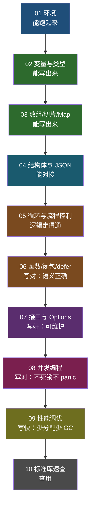

# Go 入门教学文稿 · 索引与学习路线

> 本目录由原 21 篇散篇教程合并整理而成，按「能写 → 写对 → 写好 → 写快」四层递进重新编排。
> 知识点无删减，仅去重（重复代码块、重复链接块），并补充了必要的教学说明与标点纠错。

## 一、文件清单

| # | 文档 | 合并来源 | 核心问题 |
|---|---|---|---|
| 01 | [环境安装与项目结构](01-环境安装与项目结构.md) | 原 01 | 怎么跑起来 |
| 02 | [变量、常量与数据类型](02-变量、常量与数据类型.md) | 原 02 | 数据怎么存 |
| 03 | [数组、切片与 Map](03-数组、切片与%20Map.md) | 原 03 + 04 + 06 | 集合怎么用 |
| 04 | [结构体与 JSON](04-结构体与%20JSON.md) | 原 05 + 11 + 12 | 数据怎么传 |
| 05 | [循环与流程控制](05-循环与流程控制.md) | 原 07 | 逻辑怎么走 |
| 06 | [函数、闭包与 defer](06-函数、闭包与%20defer.md) | 原 08 + 10 | 逻辑怎么复用 |
| 07 | [接口与 Options 模式](07-接口与%20Options%20模式.md) | 原 13 + 14 | 代码怎么设计 |
| 08 | [并发编程](08-并发编程.md) | 原 09 + 20 + 21 | 多任务怎么跑 |
| 09 | [性能调优](09-性能调优.md) | 原 16 + 17 + 18 + 19 | 代码怎么快 |
| 10 | [常用标准库速查](10-常用标准库速查.md) | 原 15 + 补充 | 日常怎么写 |

## 二、学习路线图



## 三、模块依赖关系（前置知识）

| 文档 | 依赖的前置知识 | 为什么要先学 |
|---|---|---|
| 03 | 02 | 数组元素类型来自变量声明 |
| 04 | 02、03 | struct 字段可以是任意基础类型，JSON 解析产出常是 map |
| 06 | 02、04 | `:=` 的作用域决定 defer 参数取值；结构体传指针决定修改是否生效 |
| 07 | 06 | Options 是「函数 + 闭包 + defer 归还」的组合应用 |
| 08 | 06 | 「defer 只对当前协程有效」是并发必知 |
| 09 | 03、04、07 | `map[string]interface{}` 慢（04 已预告）、对象池（07 已用到） |
| 10 | 06 | 时间格式化本质是函数封装 |

**三个关键衔接点**：

1. **04 → 09**：`04` 讲 JSON 解析用 `map[string]interface{}` 会有问题，`09` 从性能角度给出同一结论的原因。
2. **07 → 09**：`07` 讲 Options 模式并**标注了 sync.Pool 池化小对象的反模式**（A16），`09` 讲 Pool 的正确使用场景与 victim cache。
3. **06 → 08**：`06` 的「defer 只对当前协程有效」直接决定了「每个 goroutine 都要自己 recover」。

## 四、示例代码

所有可运行示例位于 [`../codes/教学/`](../codes/教学)。

**目录清单与运行方式以 [`../codes/教学/README.md`](../codes/教学/README.md) 为单一事实来源**（本文件不再复制表格，避免两处失同步）。

```bash
cd 00-基础语法/codes/教学

go vet ./... && gofmt -l . && go test ./...   # 全量校验（与 CI 一致）
go run ./s02_var                              # 运行某一篇的示例
go test -bench . -benchmem ./s16_bench        # 第 09 篇的基准测试
go build -gcflags '-m -l' ./s17_escape       # 第 09 篇的逃逸分析
```

## 五、学习节奏建议（按学时，共 20 学时）

> 节奏按**学时**而非周排：08/09 两篇信息密度约为 01 篇的 3~4 倍，不能用同样的天数衡量。
> 验收标准均为**可观测行为**（口述 / 白板写出 / 命令通过）。

| 学时 | 文档 | 验收标准（可观测） |
|---|---|---|
| 2 | 01 | 能口述 GOPATH 与 Modules 的区别；`go mod init` + `go build` 一次成功 |
| 2 | 02 | 能白板写出三种变量声明；能解释 `iota` 输出结果 |
| 4 | 03 | 能白板写出三索引切片并解释 `cap` 变化；能复现 nil map panic |
| 3 | 04 | 能让给定 JSON 解析出 struct；能解释 2^53 边界与科学计数法的区别 |
| 2 | 05 | 能口述 `fallthrough` 与 break 标签的输出顺序 |
| 3 | 06 | 能白板写出 defer 经典题的 4 行输出；能解释 `t2()` 为何返回 2 |
| 2 | 07 | 能用接口封装一个模块并让 `go vet` 通过；能解释 A16 反模式 |
| 5 | 08 | 能用 WaitGroup 编排任务并解释为什么不用 Sleep；能用 `-race` 定位竞态 |
| 4 | 09 | 能用 Benchmark 定位一处性能问题并给出优化前后 `allocs/op` 对比 |
| 1 | 10 | 能现场写出 RFC3339 → `2006-01-02 15:04:05` 的转换函数 |

## 六、原始 21 篇 → 10 篇对照表

| 原始 | 归属 | 原始 | 归属 |
|---|---|---|---|
| 01 环境安装 | 01 | 12 JSON 小坑 | 04（四） |
| 02 变量声明 | 02 | 13 struct 实现 interface | 07（一） |
| 03 数组 | 03（一） | 14 grpc.Dial 写法 | 07（二） |
| 04 Slice | 03（二） | 15 RFC3339 | 10（一） |
| 05 Struct | 04（一） | 16 签名算法基准 | 09（一） |
| 06 Map | 03（三） | 17 两个注意点 | 09（二） |
| 07 循环 | 05 | 18 sync.Pool | 09（四） |
| 08 函数 | 06（一 ~ 三） | 19 逃逸分析 | 09（三） |
| 09 chan | 08（一） | 20 sync.Map | 08（三） |
| 10 defer | 06（四） | 21 WaitGroup | 08（二） |
| 11 解析 JSON | 04（二、三） | — | — |

**去重仅 3 处**，无知识点删减：

1. 原 05「改变数据」与原 08「引用传递」使用**同一份 `demo_13.go`** → 统一收敛到 06（二），04（一）只保留 struct 定义。
2. 原 18/19/20/21 结尾**重复出现同一组「推荐阅读」链接**（共 4 遍）→ 删除。
3. 图片链接由 GitHub 完整 URL 改为本地相对路径（`images/...`），指向同一批文件。

**修正的原文问题**（审阅后核对，仅保留可复核的条目）：

- 原 01 基于 Go 1.12 + GOPATH，已按现代 Go（Go Modules）重写。
- 原 04 有一处笔误：`var sli_2 = [] int {}` 下一行打印时误用了 `sli_1` 的 `len`，已修正。
- 已通过 `go vet ./...`、`gofmt -l .`、`go build ./...`、`go test ./...` 全量校验（工具链 go1.25.1，2026-10-04）。
