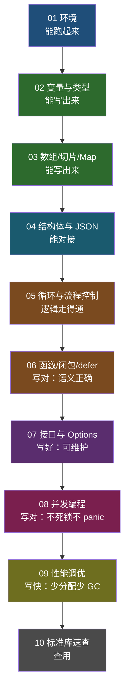

# Go 入门教学文稿 · 索引与学习路线

> 本目录由原 21 篇散篇教程合并整理而成，按「能写 → 写对 → 写好 → 写快」四层递进重新编排。
> 知识点无删减，仅去重（重复代码块、重复链接块），并补充了必要的教学说明与标点纠错。

## 一、文件清单

| # | 文档 | 合并来源 | 核心问题 |
|---|---|---|---|
| 01 | [环境安装与项目结构](01-环境安装与项目结构.md) | 原 01 | 怎么跑起来 |
| 02 | [变量、常量与数据类型](02-变量、常量与数据类型.md) | 原 02 | 数据怎么存 |
| 03 | [数组、切片与 Map](03-数组、切片与%20Map.md) | 原 03 + 04 + 06 | 集合怎么用 |
| 04 | [结构体与 JSON](04-结构体与%20JSON.md) | 原 05 + 11 + 12 | 数据怎么传 |
| 05 | [循环与流程控制](05-循环与流程控制.md) | 原 07 | 逻辑怎么走 |
| 06 | [函数、闭包与 defer](06-函数、闭包与%20defer.md) | 原 08 + 10 | 逻辑怎么复用 |
| 07 | [接口与 Options 模式](07-接口与%20Options%20模式.md) | 原 13 + 14 | 代码怎么设计 |
| 08 | [并发编程](08-并发编程.md) | 原 09 + 20 + 21 | 多任务怎么跑 |
| 09 | [性能调优](09-性能调优.md) | 原 16 + 17 + 18 + 19 | 代码怎么快 |
| 10 | [常用标准库速查](10-常用标准库速查.md) | 原 15 + 补充 | 日常怎么写 |

## 二、学习路线图



## 三、模块依赖关系（前置知识）

| 文档 | 依赖的前置知识 | 为什么要先学 |
|---|---|---|
| 03 | 02 | 数组元素类型来自变量声明 |
| 04 | 02、03 | struct 字段可以是任意基础类型，JSON 解析产出常是 map |
| 06 | 02、04 | `:=` 的作用域决定 defer 参数取值；结构体传指针决定修改是否生效 |
| 07 | 06 | Options 是「函数 + 闭包 + defer 归还」的组合应用 |
| 08 | 06 | 「defer 只对当前协程有效」是并发必知 |
| 09 | 03、04、07 | `map[string]interface{}` 慢（04 已预告）、对象池（07 已用到） |
| 10 | 06 | 时间格式化本质是函数封装 |

**三个关键衔接点**：

1. **04 → 09**：`04` 讲 JSON 解析用 `map[string]interface{}` 会有问题，`09` 从性能角度给出同一结论的原因。
2. **07 → 09**：`07` 的 `releaseOption` 已经用上 `sync.Pool`，`09` 讲它的原理与注意事项。
3. **06 → 08**：`06` 的「defer 只对当前协程有效」直接决定了「每个 goroutine 都要自己 recover」。

## 四、示例代码

所有可运行示例位于 [`../codes/教学/`](../codes/教学)，已按篇拆成独立子目录，避免 `main redeclared`。

```bash
cd 00-基础语法/codes/教学

go run ./s02_var            # 运行某一篇的示例
go test -bench . -benchmem ./...   # 运行第 09 篇的基准测试
go build ./...              # 全量编译验证
```

| 目录 | 对应文档 | 演示内容 |
|---|---|---|
| `s01_hello/` | 01 | Hello World |
| `s02_var/` | 02 | 常量/变量声明、四种 fmt 输出 |
| `s03_array/` | 03 | 一维/二维数组、三大注意事项 |
| `s04_slice/` | 03 | 声明、截取、append 扩容、三种删除 |
| `s05_struct/` | 04 | 命名/匿名结构体、JSON tag、指针传参 |
| `s06_map/` | 03 | 六种声明、嵌套、编辑删除、遍历 |
| `s07_loop/` | 05 | 三种容器遍历、break/continue/goto/switch |
| `s08_func/` | 06 | 传值 vs 传指针、闭包 |
| `s08_sign/` | 06 | MD5 + 生成签名 |
| `s08_defer/` | 06 | defer 经典题 + 五个坑 |
| `s09_interface/` | 07 | interface 隐式实现 + 编译期断言 |
| `s10_option/` | 07 | Options 模式 + sync.Pool 复用 |
| `s11_timeutil/` | 10 | RFC3339 转 CST |
| `s12_json/` | 04 | 强类型/弱类型/squash/UseNumber |
| `s13_chan/` | 08 | 并发vs并行、channel 阻塞、select、Worker Pool |
| `s14_waitgroup/` | 08 | 正确用法 + 三个坑 |
| `s15_syncmap/` | 08 | 并发 map panic、sync.Map、Range 求长度 |
| `s16_bench/` | 09 | 签名算法基准测试 |
| `s17_escape/` | 09 | 三种逃逸场景 |

## 五、学习节奏建议

| 阶段 | 文档 | 建议投入 | 验收标准 |
|---|---|---|---|
| 第 1 周 | 01 ~ 04 | 4 天 | 能独立写出一个 struct + JSON 互转的工具 |
| 第 2 周 | 05 ~ 07 | 4 天 | 能说清 defer 五个坑的输出顺序；能用接口封装一个模块 |
| 第 3 周 | 08 | 3 天 | 能用 WaitGroup 编排并发任务并解释为什么不用 Sleep |
| 第 4 周 | 09 ~ 10 | 3 天 | 能用 Benchmark 定位并优化一处性能问题 |

## 六、原始 21 篇 → 10 篇对照表

| 原始 | 归属 | 原始 | 归属 |
|---|---|---|---|
| 01 环境安装 | 01 | 12 JSON 小坑 | 04（四） |
| 02 变量声明 | 02 | 13 struct 实现 interface | 07（一） |
| 03 数组 | 03（一） | 14 grpc.Dial 写法 | 07（二） |
| 04 Slice | 03（二） | 15 RFC3339 | 10（一） |
| 05 Struct | 04（一） | 16 签名算法基准 | 09（一） |
| 06 Map | 03（三） | 17 两个注意点 | 09（二） |
| 07 循环 | 05 | 18 sync.Pool | 09（四） |
| 08 函数 | 06（一 ~ 三） | 19 逃逸分析 | 09（三） |
| 09 chan | 08（一） | 20 sync.Map | 08（三） |
| 10 defer | 06（四） | 21 WaitGroup | 08（二） |
| 11 解析 JSON | 04（二、三） | — | — |

**去重仅 3 处**，无知识点删减：

1. 原 05「改变数据」与原 08「引用传递」使用**同一份 `demo_13.go`** → 统一收敛到 06（二），04（一）只保留 struct 定义。
2. 原 18/19/20/21 结尾**重复出现同一组「推荐阅读」链接**（共 4 遍）→ 删除。
3. 图片链接由 GitHub 完整 URL 改为本地相对路径（`images/...`），指向同一批文件。

**修正的原文问题**：

- 原 01 基于 Go 1.12 + GOPATH，已按 Go 1.22 重写（Go Modules）。
- 原 04 有一处笔误：`var sli_2 = [] int {}` 下一行打印时误用了 `sli_1` 的 `len`，已修正。
- 原 07 `demo_22.go` 代码块末尾缺右花括号，已补全。
- 原文多处 `//` 写在代码块内作注释（非合法 Go 注释），已改为 `//`。
