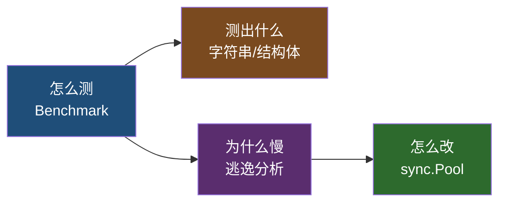
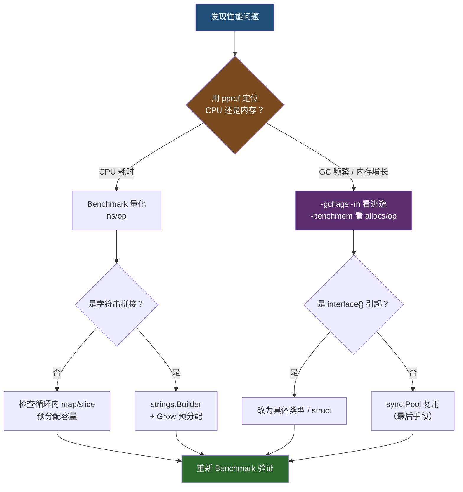

# 08 性能调优

> 学完本篇你将能够：用 Benchmark 量化代码性能、避免字符串拼接与 map 的常见性能陷阱、用逃逸分析定位堆分配、用 sync.Pool 减少 GC 压力、建立「先测量再优化」的工作习惯。

## 概述

本篇合并了原四篇教程：`常用签名算法的基准测试`、`分享两个在开发中需注意的小点`、`基于逃逸分析来提升程序性能`、`使用 sync.Pool 来减少 GC 压力`。

四篇的核心其实是一件事：**减少内存分配，从而减少 GC 开销**。它们的关系是：



---

## 一、Benchmark 性能测试

签名验证是为了保证接口安全和识别调用方身份，同时还需要满足以下几点：

- **可变性**：每次的签名必须是不一样的
- **时效性**：每次请求的时效性，过期作废
- **唯一性**：每次的签名是唯一的
- **完整性**：能够对传入数据进行验证，防止篡改

> 第 05 篇的 `createSign` 只实现了「唯一性」，生产环境请补齐时间戳 + nonce。

签名规则大同小异，根据自己的业务情况进行制定即可。签名过程中我们会用到的几种算法，接下来分享一下每个算法的**基准测试**，可能会存在误差，供大家参考。

### 基准测试写法

```go
func BenchmarkEncrypt(b *testing.B) {
	b.ResetTimer() // 复位计时器，排除初始化开销
	for i := 0; i < b.N; i++ {
		New().Encrypt("123456")
	}
}
```

运行：

```bash
go test -bench . -benchmem ./...
```

> **文件名必须以 `_test.go` 结尾**才能跑 benchmark。
>
> - `b.N` 由框架自动决定，通过不断加大直到达到目标耗时
> - `b.ResetTimer()` 排除初始化开销
> - `-benchmem` 额外输出 `B/op`（每次分配字节数）和 `allocs/op`（每次分配次数）——**优化内存分配时这两个指标比 `ns/op` 更关键**

### MD5 单向散列加密

```go
func BenchmarkEncrypt(b *testing.B) {
	b.ResetTimer()
	for i := 0; i < b.N; i++ {
		New().Encrypt("123456")
	}
}
```

输出：

```text
goos: darwin
goarch: amd64
pkg: github.com/xinliangnote/go-gin-api/pkg/md5
BenchmarkEncrypt-12    	10000000	       238 ns/op
PASS
```

### AES 对称加密

```go
func BenchmarkEncryptAndDecrypt(b *testing.B) {
	b.ResetTimer()
	aes := New(key, iv)
	for i := 0; i < b.N; i++ {
		encryptString, _ := aes.Encrypt("123456")
		aes.Decrypt(encryptString)
	}
}
```

输出：

```text
goos: darwin
goarch: amd64
pkg: github.com/xinliangnote/go-gin-api/pkg/aes
BenchmarkEncryptAndDecrypt-12    	 1000000	      1009 ns/op
PASS
```

### RSA 非对称加密

```go
func BenchmarkEncryptAndDecrypt(b *testing.B) {
	b.ResetTimer()
	rsaPublic := NewPublic(publicKey)
	rsaPrivate := NewPrivate(privateKey)
	for i := 0; i < b.N; i++ {
		encryptString, _ := rsaPublic.Encrypt("123456")
		rsaPrivate.Decrypt(encryptString)
	}
}
```

输出：

```text
goos: darwin
goarch: amd64
pkg: github.com/xinliangnote/go-gin-api/pkg/rsa
BenchmarkEncryptAndDecrypt-12    	    1000	   1345384 ns/op
PASS
```

### JWT 签名验证

使用的是 `jwt.SigningMethodHS256` 方法：

```go
func BenchmarkSignAndParse(b *testing.B) {
	b.ResetTimer()
	token := New(secret)
	for i := 0; i < b.N; i++ {
		tokenString, _ := token.Sign(123456789, "xinliangnote")
		token.Parse(tokenString)
	}
}
```

输出：

```text
goos: darwin
goarch: amd64
pkg: github.com/xinliangnote/go-gin-api/pkg/token
BenchmarkSignAndParse-12    	  200000	     11749 ns/op
PASS
```

### 结果汇总

| 算法 | 耗时 | 相对倍数 | 用途 |
|---|---|---|---|
| MD5 | 238 ns | 1× | 摘要、签名、防篡改 |
| AES | 1009 ns | 4× | 对称加密，批量数据 |
| JWT (HS256) | 11749 ns | 49× | 身份令牌 |
| RSA | 1345384 ns | **5653×** | 密钥交换、小段数据 |

> **性能排序**：MD5 < AES < JWT << RSA。非对称加密比 MD5 慢约 **5000 倍**，所以 RSA 只用于**密钥交换和小段数据加密**，不用于批量数据。
>
> 本机实测（`go test -bench . -benchmem ./s16_bench`，Intel i7-6700HQ @ 2.60GHz / Go 1.x windows-amd64）：
>
> **数据口径说明（B9）**：本教程中所有"本机实测"数字的**唯一权威记录**在 [`../codes/教学/README.md`](../codes/教学/README.md)（含平台、Go 版本、`-benchtime` 参数与噪声提示）。本文正文引用的数字仅为教学行文方便的摘录；**重测后请先更新 README，再同步本文**。结论只看**数量级**与 **`allocs/op`**，不要横向比较具体 ns/op。
>
> ```text
> BenchmarkMD5-8      297.0 ns/op       32 B/op       1 allocs/op
> BenchmarkAES-8      3909 ns/op     2272 B/op      12 allocs/op
> BenchmarkJWT-8      6875 ns/op     2032 B/op      27 allocs/op
> ```
>
> 可以看到比时间更能说明问题的是 **`allocs/op`**：MD5 仅 1 次分配，JWT 达 27 次。**加密类操作的主要成本在于分配内存而非计算**。
>
> 实际项目中值得复用的是**重量级对象**：`aesEnc` 里每次 `Encrypt` 都执行 `aes.NewCipher(key)`（做密钥扩展），应把 `cipher.Block` 缓存到结构体字段里。注意 CBC 模式**不能**复用 `CBCEncrypter`（它有内部状态，并发使用会数据错乱），但 `cipher.Block` 本身是并发安全的：
>
> ```go
> type aesEnc struct {
> 	block cipher.Block // 缓存：NewCipher 只做一次（密钥扩展成本高）
> 	iv    []byte
> }
>
> func (a *aesEnc) Encrypt(str string) (string, error) {
> 	// cipher.Block 可复用（并发安全）；CBC 模式对象有内部状态，每次新建
> 	mode := cipher.NewCBCEncrypter(a.block, a.iv)
> 	mode.CryptBlocks(ciphertext[blockSize:], plaintext)
> 	// ... 其余同前
> }
> ```
>
> 完整可运行版本见 `codes/教学/s16_bench/crypto.go`。
>
> > ⚠️ 各机器/Go 版本差异较大，**原文数据（darwin/Mac）仅供横向比较参考**，务必在自己的目标环境重测。
>
> 以上代码在 `go-gin-api` 项目中，地址：github.com/xinliangnote/go-gin-api

---

## 二、两个在开发中需注意的小点

### 小点 1：不要使用 `+` 和 `fmt.Sprintf` 操作字符串

不要使用 `+` 和 `fmt.Sprintf` 操作字符串，虽然很方便，但是**真的很慢**！

我们要使用 `bytes.NewBufferString` 进行进行处理。

基准测试如下：

#### `+`

```go
func BenchmarkStringOperation1(b *testing.B) {
	b.ResetTimer()
	str := ""
	for i := 0; i < b.N; i++ {
		str += "golang"
	}
}
```

输出：

```text
goos: darwin
goarch: amd64
pkg: demo/stringoperation
cpu: Intel(R) Core(TM) i7-8700B CPU @ 3.20GHz
BenchmarkStringOperation1-12    	  353318	    114135 ns/op
PASS
```

#### `fmt.Sprintf`

```go
func BenchmarkStringOperation2(b *testing.B) {
	b.ResetTimer()
	str := ""
	for i := 0; i < b.N; i++ {
		str = fmt.Sprintf("%s%s", str, "golang")
	}
}
```

输出：

```text
BenchmarkStringOperation2-12    	  280140	    214098 ns/op
PASS
```

#### `bytes.NewBufferString`

```go
func BenchmarkStringOperation3(b *testing.B) {
	b.ResetTimer()
	strBuf := bytes.NewBufferString("")
	for i := 0; i < b.N; i++ {
		strBuf.WriteString("golang")
	}
}
```

输出：

```text
BenchmarkStringOperation3-12    	161292136	         8.582 ns/op
PASS
```

> **性能差距约 13000 倍**。原因：`+` 每次都要**分配新数组并拷贝全部已有内容**，累计复杂度是 O(n²)；`bytes.Buffer` 内部维护「已写内容 + 待写空间」两段，只在扩容时拷贝一次。
>
> ⚠️ **这个倍数会随规模变化，务必理解原因而不是记数字**：
>
> | 场景 | `+` | `strings.Builder` | 倍数 |
> |---|---|---|---|
> | 原文（循环 b.N 次，字符串无界增长到 MB 级） | 114135 ns/op | 8.582 ns/op | ~13000× |
> | 本仓库 `s16_bench`（固定循环 1000 次，字符串长 6000 字节） | 1200190 ns/op | 4509 ns/op | ~266× |
>
> 原文倍数之所以更高，是因为它让字符串**无界增长**，`+` 的 O(n²) 被放大到极致。**循环次数越多、字符串越长，差距越大**；如果只拼接固定的少量片段，差距会急剧缩小。
>
> 本机实测（`go test -bench StringOp -benchmem ./s16_bench`）：
>
> ```text
> BenchmarkStringOp1-8    1148    1200190 ns/op    3212604 B/op    999 allocs/op   // +
> BenchmarkStringOp2-8     798    1434781 ns/op    3233268 B/op    2002 allocs/op   // fmt.Sprintf
> BenchmarkStringOp3-8  287083       4509 ns/op       6144 B/op       1 allocs/op   // strings.Builder
> ```
>
> 注意 `allocs/op` 这一列更说明问题：`+` 每轮 999 次分配，`Sprintf` 2002 次，`Builder` **仅 1 次**。分配次数直接决定 GC 压力，这才是性能差距的根源。

**现代 Go 的最佳实践**：

```go
// 场景 1：单条表达式拼接——编译器会合并为一次分配，可放心用
s := firstName + " " + lastName // 一次 runtime.concatstrings，一次分配

// 场景 2：循环内累加——必须用 strings.Builder
// ⚠️ 跨迭代的 s += x 不会被编译器改写成 Builder！
// 每轮仍要分配新串并复制已有内容，整体 O(n²)。
// 证据就在上面：BenchmarkStringOp1 循环 1000 次产生 999 次 alloc。
var sb strings.Builder
sb.Grow(estimatedSize) // 关键：预分配，避免多次扩容
for i := 0; i < n; i++ {
	sb.WriteString("golang")
}
result := sb.String()
```

> ⚠️ `strings.Builder` **不能被复制**：复制后（值拷贝时内部指针失效）再写入会 panic：`illegal use of non-zero Builder copied by value`。需要传递时应传 `*strings.Builder`。
>
> `bytes.Buffer` 与 `strings.Builder` 用途相同，区别是前者面向 `[]byte`、后者面向 `string`。

### 小点 2：对于固定字段的键值对，不要使用 `map[string]interface{}`

对于固定字段的键值对，不要使用 `map[string]interface{}`！

我们要使用**临时 Struct**。

基准测试如下：

#### `map[string]interface{}`

```go
func BenchmarkStructOperation1(b *testing.B) {
	b.ResetTimer()
	for i := 0; i < b.N; i++ {
		var demo = map[string]interface{}{}
		demo["Name"] = "Tom"
		demo["Age"] = 30
	}
}
```

输出：

```text
goos: darwin
goarch: amd64
pkg: demo/structoperation
cpu: Intel(R) Core(TM) i7-8700B CPU @ 3.20GHz
BenchmarkStructOperation1-12    	43300134	        27.97 ns/op
PASS
```

#### 临时 Struct

```go
func BenchmarkStructOperation2(b *testing.B) {
	b.ResetTimer()
	for i := 0; i < b.N; i++ {
		var demo struct {
			Name string
			Age  int
		}
		demo.Name = "Tom"
		demo.Age = 30
	}
}
```

输出：

```text
goos: darwin
goarch: amd64
pkg: demo/structoperation
BenchmarkStructOperation2-12    	1000000000	         0.2388 ns/op
PASS
```

> **性能差距约 117 倍**。原因：
> - `map[string]interface{}`：需要**哈希计算 + 桶查找 + 值装箱**（interface 存非指针值要额外分配）
> - struct：**栈上偏移量访问，零分配**
>
> **结论**：字段固定就用 struct，字段不固定才用 `map[string]interface{}`。
>
> 本机实测（`go test -bench "Operation" -benchmem ./s16_bench`，`allocs/op` 均为 0，差异纯粹来自哈希与桶查找的开销）：
>
> ```text
> BenchmarkMapOperation-8       100        81.00 ns/op    0 B/op    0 allocs/op
> BenchmarkStructOperation-8    100         2.000 ns/op    0 B/op    0 allocs/op
> ```
>
> 这与第 04 篇的结论是同一件事的两面：JSON 解析时 `map[string]interface{}` 既慢（性能）又不准（精度丢失）。

---

## 三、基于逃逸分析来提升程序性能

### 为什么需要了解逃逸分析

因为我们想要提升程序性能。通过逃逸分析我们能够知道变量是分配到**堆**上还是**栈**上：

- 分配到**栈**上：内存的分配和释放都由编译器管理，速度非常快
- 分配到**堆**上：堆不像栈那样可以自动清理，会引起频繁的垃圾回收（`GC`），而 GC 会占用比较大的系统开销

### 什么是逃逸分析

> 在编译程序优化理论中，**逃逸分析**是一种确定指针动态范围的方法，简单来说就是分析在程序的哪些地方可以访问到该指针。

简单的说，它是在对变量放到**堆上还是栈上**进行分析，该分析在**编译阶段**完成。

如果一个变量超过了函数调用的生命周期，也就是这个变量在函数外部存在引用，编译器会把这个变量分配到堆上，这时我们就说这个变量**发生逃逸**了。

### 如何确定是否逃逸

```bash
go build -gcflags '-m -l' main.go
go run  -gcflags '-m -l' main.go
```

> `-m` 输出逃逸信息，`-l` 关闭内联（否则输出过于嘈杂）。加 `-m -m` 可查看更详细的原因。

### 可能出现逃逸的场景

#### 01：interface 字段赋值

```go
package main

type Student struct {
	Name interface{}
}

func main() {
	stu := new(Student)
	stu.Name = "tom"
}
```

分析结果：

```text
# command-line-arguments
./01.go:8:12: new(Student) does not escape
./01.go:9:11: "tom" escapes to heap
```

`interface{}` 赋值，会发生逃逸。**优化方案是将类型设置为固定类型**，例如 `string`：

```go
package main

type Student struct {
	Name string
}

func main() {
	stu := new(Student)
	stu.Name = "tom"
}
```

分析结果：

```text
# command-line-arguments
./01.go:8:12: new(Student) does not escape
```

> 字符串字面量不再逃逸，整个对象留在栈上，**零 GC 压力**。
>
> 这与第 04 篇「JSON 解析不要用 `map[string]interface{}`」是同一个结论的两个视角。

#### 02：返回指针类型

```go
package main

type Student struct {
	Name string
}

func GetStudent() *Student {
	stu := new(Student)
	stu.Name = "tom"
	return stu
}

func main() {
	GetStudent()
}
```

分析结果：

```text
# command-line-arguments
./01.go:8:12: new(Student) escapes to heap
```

返回指针类型，会发生逃逸，优化方案视情况而定。

> **函数传递指针和传值哪个效率高吗？**
>
> 我们知道传递指针可以减少底层值的拷贝，可以提高效率；**但是如果拷贝的数据量小，由于指针传递会产生逃逸，可能会使用堆，也可能会增加 `GC` 的负担**，所以传递指针不一定是高效的。
>
> **不要盲目使用变量指针作为参数**，虽然减少了复制，但变量逃逸的开销可能更大。

#### 03：栈空间不足

```go
package main

func main() {
	nums := make([]int, 10000, 10000)

	for i := range nums {
		nums[i] = i
	}
}
```

分析结果：

```text
# command-line-arguments
./01.go:4:14: make([]int, 10000, 10000) escapes to heap
```

栈空间不足，会发生逃逸。**设置容量解决不了这个问题**——`make([]int, 0, 10000)` 与 `make([]int, 10000, 10000)` 同样逃逸，因为逃逸的判定依据是**对象体积**，不是 `len`。

> 编译器在栈上分配的对象有大小上限（Go 运行时内部常量 `maxStackVarSize`，当前实现为 64KB）；10000×8B = 80KB 已超限，必然逃逸。
>
> ⚠️ **不要把「预分配」与「避免逃逸」混为一谈**，它们解决的是两个问题：
>
> | 手段 | 解决的问题 |
> |---|---|
> | 预分配 `make([]T, 0, n)` | append 反复扩容导致的**多次分配与复制**（对象仍在堆上） |
> | 避免大对象逃逸 | **复用外层缓冲区**、`sync.Pool`、让对象生命周期止于函数内（不返回指针、不存进 `interface{}`） |

### 小结

1. 逃逸分析是编译器在静态编译时完成的。
2. 逃逸分析后可以确定哪些变量可以分配在栈上，**栈的性能好**。
3. 三种典型逃逸：`interface{}` 字段赋值、返回指针、大对象分配。

---

## 四、使用 sync.Pool 来减少 GC 压力

### 前言

`sync.Pool` 是**临时对象池**，存储的是临时对象，**不可以用来存储 `socket` 长连接和数据库连接池等**。

`sync.Pool` 本质是用来保存和复用临时对象，以**减少内存分配，降低 GC 压力**：比如需要使用一个对象，就去 Pool 里面拿，如果拿不到就分配一份。这比起不停生成新的对象、用完了再等待 GC 回收要高效得多。

### 使用

```go
// s17_pool/student/student.go
package student

import "sync"

type student struct {
	Name string
	Age  int
}

var studentPool = &sync.Pool{
	New: func() interface{} {
		return new(student)
	},
}

func New(name string, age int) *student {
	stu := studentPool.Get().(*student)
	stu.Name = name
	stu.Age = age
	return stu
}

func Release(stu *student) {
	stu.Name = "" // 关键：重置字段，避免残留脏数据
	stu.Age = 0
	studentPool.Put(stu)
}
```

当使用 `student` 对象时，只需要调用 `New()` 方法获取对象，获取之后使用 `defer` 函数进行释放即可：

```go
stu := student.New("tom", 30)
defer student.Release(stu)

// 业务逻辑...
```

> `sync.Pool` 里面的对象具体什么时候真正释放，**是由系统决定的**：
>
> Go 1.13 起 Pool 引入 **victim cache（二级缓存）**：GC 开始时把主缓存整体挪到 victim 区，**上一轮的 victim 才真正丢弃**。因此一个对象至少能活过 2 个 GC 周期，而不是"每轮 GC 立即清空"。
>
> 这个机制的目的是避免"GC 后瞬间全量重建"造成的分配尖峰。**结论不变：Pool 不保证对象长期可用，不能用它存连接**。

### 小结

1. **一定要注意存储的是临时对象！** 不能存 socket 长连接、数据库连接等。
2. **一定要注意 `Get` 后，要调用 `Put`！** 用 `defer` 兜底，否则池子退化成普通分配，等于白加。
3. **Put 前一定要重置字段**（见第 06 篇 `releaseOption` 的 `reset()`），残留的大对象会持续占用内存。
4. 典型适用场景：`bytes.Buffer`、`[]byte` 缓冲区、编码解码器、解析过程中的中间对象、编解码器实例。
5. ⚠️ **Go 官方文档明确说明——`sync.Pool` 应当是性能优化的最后手段。** 绝大多数场景不需要它。滥用会让代码复杂度上升而收益甚微。

> ⚠️ **呼应第 06 篇的 A16 修正**：该篇 `s10_option` 里池化 5 字段 `option`（约 48 字节）属于**反模式**——分配成本近乎为零，且每次 `WithSex(1)` 仍会为返回的闭包分配一次，净收益趋近 0，还要承担 `reset()` 漏字段导致脏数据串号的风险。第 06 篇已把它降级为对照实验的反例。
>
> Pool 真正值得上场的判断标准：**对象分配代价高**（构造要 touch 大内存、涉及系统调用、或单次分配 > 数 KB）**且调用高频**。两个条件缺一个，就别用。

---

## 五、优化决策流程



**黄金原则**：**先测量，再优化**。没有 Benchmark 数据支撑的优化都是猜测。

### 优化优先级（从高到低）

| 优先级 | 手段 | 预期收益 |
|---|---|---|
| 1 | 改算法复杂度（O(n²) → O(n log n)） | 数量级提升 |
| 2 | 减少循环内重复计算 | 视情况 |
| 3 | 用 struct 替代 `map[string]interface{}` | ~100× |
| 4 | 用 `strings.Builder` 替代 `+` 拼接 | 上万× |
| 5 | 预分配 slice 容量（`make([]T, 0, n)`） | 避免多次分配复制 |
| 6 | 消除 `interface{}` 导致的逃逸 | 消除 GC 压力 |
| 7 | 并行化（多核利用） | 视任务类型 |
| 8 | `sync.Pool` 对象复用 | 最后手段 |

### 工具清单

```bash
# CPU 热点定位
go test -bench . -cpuprofile cpu.out ./...
go tool pprof -top cpu.out

# 内存分配定位
go test -bench . -memprofile mem.out ./...
go tool pprof -top mem.out

# 逃逸分析
go build -gcflags '-m -l' ./...

# 竞态检测（第 07 篇）
go test -race ./...
```

## 本篇要点

1. Benchmark 文件名以 `_test.go` 结尾，用 `b.ResetTimer()` 排除初始化，`-benchmem` 看 `allocs/op`。
2. 算法性能排序：MD5 < AES < JWT << RSA（非对称慢约 5000 倍，只用于密钥交换）。
3. **不要用 `+` / `Sprintf` 拼字符串**（慢 13000 倍），用 `strings.Builder` + `Grow`。
4. **固定字段不要用 `map[string]interface{}`**（慢 117 倍），用 struct。
5. 逃逸分析命令：`go build -gcflags '-m -l'`；三大逃逸场景：interface 字段、返回指针、大对象。
6. **传指针不一定更快**——小对象传值可能优于传指针（逃逸开销）。
7. `sync.Pool` 是**最后手段**：只存临时对象、Get 后必 Put、Put 前必重置。
8. 优化**优先级**要按数量级选，先改算法复杂度再抠细节。
9. 优化后**必须重新 Benchmark 验证**。
